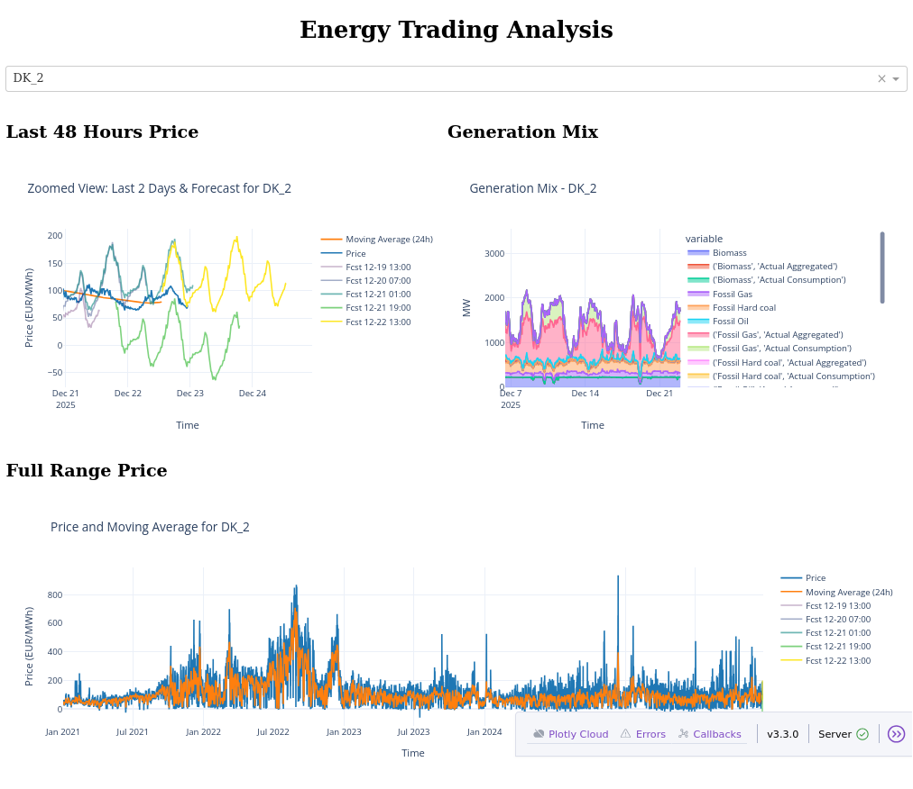

# Energy Trading Analysis

A toolkit for ingesting, analyzing and statically reporting day-ahead electricity prices and generation mixes across European bidding zones. Produces per-country HTML reports (Bokeh), time-series features and simple forecasts useful for research, dashboards and reproducible reporting.



*Example dashboard showing short-term price forecasts, generation mix breakdown, and long-term price history across European bidding zones.*


## 🌟 Overview

This repository provides utilities and pipelines to:
- Download day-ahead price and generation data from ENTSO‑E
- Compute time-series features (moving averages, seasonal decomposition, Holt–Winters forecasts)
- Generate static per-country interactive reports (Bokeh) and an index page
- Run repeatable analysis pipelines from the command line or inside Docker/Nix

## 🚀 Features

- Resume-safe CSV downloads and local caching
- Time-series features: rolling means, seasonal decomposition and simple backtestable forecasts
- Holt–Winters forecasting with automatic frequency handling and basic backtesting
- Static, interactive Bokeh reports per-country with an auto-generated index (`docs/index.html`)
- Multiple environment provisioning options: pip, conda and Nix
- Dockerfile for serving `docs/` as static site via nginx

## 🛠️ Dependencies

- Python 3.8+ (3.10/3.12 recommended)
- Typical Python packages: `pandas`, `numpy`, `statsmodels`, `bokeh`, `matplotlib`, `requests`
- See `requirements.txt` and `environment.yml` for full lists

## 💻 Setup & Installation

### Quick setup (Linux/macOS)
```bash
git clone <repo-url>
cd EnergyTradingAnalysis
./scripts/setup.sh
```

### Windows
```powershell
git clone <repo-url>
cd EnergyTradingAnalysis
scripts\setup.bat
```

### Manual (pip + venv)
```bash
python -m venv venv
source venv/bin/activate
pip install -r requirements.txt
```

### Conda
```bash
conda env create -f environment.yml
conda activate <env-name>
```

### Nix
```bash
nix develop
```

## 🎯 Usage

Main CLI entrypoint: `src/main.py`.

- Download data for all countries:
```bash
python src/main.py download
```

- Run analysis (compute features & forecasts):
```bash
python src/main.py analyze
```

- Generate static reports (all countries):
```bash
python src/main.py plot
```

- Generate a single country report (example):
```bash
python src/plot_bokeh.py DK_1
```

Generated HTML reports are written to `docs/` by default (see `src/config.py`).

## 🧾 License

See the `LICENSE` file in the repository root for license terms.

## 🤝 Contributing

- Open issues or PRs. For larger changes include tests and update examples in `docs/`.
- If you want me to generate a short developer guide or CI config next, say so and I will add it.
