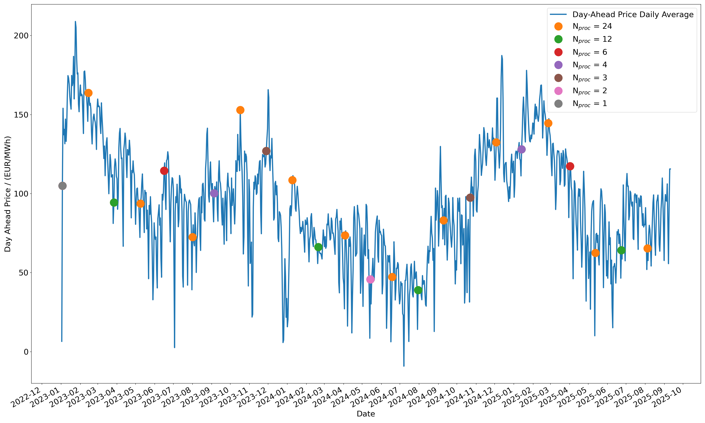

# Energy Trading Day-Ahead Price Analysis

A Python-based tool for exploring and optimizing energy procurement strategies using Danish day-ahead electricity prices (DK2). The centerpiece is an **interactive dashboard** for visualizing price trends, moving averages, and predictions for multiple countries.

## 🖼️ Interactive Dashboard


*Example: Dash web app showing price and moving average for selected country. Explore historical trends, zoom into the last 24 hours, and compare predictive features interactively.*

## 📊 Features

- **Interactive Dashboard**: Explore price and moving average trends for any country using a Dash web app (`src/plot.py`).
- **SciChart.js Stack**: High-performance alternative visualization using Flask + SciChart.js (`src/plot_scichart.py`).
- **Static HTML Reports**: 
    - **Bokeh (Recommended)**: High-performance, standalone HTML reports suitable for VCS hosting (`src/plot_bokeh.py`).
    - **ECharts**: Legacy static reports (`src/plot_echarts.py`).
- **Historical Price Analysis**: Processes 3 years of hourly electricity price data (2023-2025).
- **Procurement Optimization**: Implements adaptive procurement algorithm with configurable parameters.
- **Cost Analysis**: Compares total costs across different procurement frequencies (1-24 times per year).
- **Visualization**: Generates comprehensive charts showing price trends and optimal purchase points.

## 🚀 Quick Start

### Prerequisites
- Python 3.8+ (Windows, macOS, Linux)
- Git (optional)

### Installation

**Simple Setup:**
```bash
git clone <repository-url>
cd EnergyTradingAnalysis
pip install -r requirements.txt
```

**Alternative Methods:**
- **Automated**: Run `./scripts/setup.sh` (Linux/macOS) or `scripts\setup.bat` (Windows)
- **Conda**: `conda env create -f environment.yml && conda activate energy-trading-analysis`
- **Docker**: `docker-compose up --build`
- **Nix**: `nix develop` (Linux/macOS)

### Running the Dashboard & Analysis

From the `src/` directory:

```bash
cd src
python main.py plot                # launch interactive dashboard (Dash)
python plot_scichart.py            # launch high-performance dashboard (SciChart.js)
python plot_bokeh.py [COUNTRY]     # generate high-performance static report (e.g., DK_2)
python plot_echarts.py [COUNTRY]   # generate legacy static HTML report
python scheduled_procurement.py    # scheduling analysis + day-ahead trend plot
python day_prices.py               # hourly profile (price by hour) plot
```

**Generated Output:**
- `output/dash_screenshot.png`: Dashboard screenshot (add manually)
- `output/report_DK_2.html`: Interactive HTML report generated by Bokeh (or ECharts)
- `output/dayaheadprices.png`: Price trends with optimal purchase points (produced by `scheduled_procurement.py`)
- `output/total_cost_vs_nproc.png`: Total cost vs number of procurements (produced by `scheduled_procurement.py`)
- `output/price_by_hour.png`: Average price by hour with error bars (produced by `day_prices.py`)

## 📁 Project Structure

```
├── src/                     # Source code and analysis scripts
│   ├── main.py                  # CLI entry point (download, analyze, plot)
│   ├── plot.py                  # Dash dashboard for interactive exploration
│   ├── plot_scichart.py         # High-performance dashboard using SciChart.js
│   ├── plot_bokeh.py             # Generate static HTML reports with Bokeh
│   ├── plot_echarts.py           # Generate static HTML reports with ECharts
│   ├── datamanager.py           # Data loading and feature extraction
│   ├── dataanalysis.py          # Analysis functions (moving average, prediction)
│   ├── scheduled_procurement.py # Procurement optimization analysis
│   ├── day_prices.py            # Hourly price profile and plot
│   └── utils.py                 # Utility functions
├── data/                    # CSV price data files (2023-2025)
├── output/                  # Generated visualizations (PNG files)
├── scripts/                 # Setup scripts for different platforms
├── requirements.txt         # Python dependencies
├── environment.yml          # Conda environment
├── Dockerfile               # Docker support
├── docker-compose.yml       # Docker orchestration
├── flake.nix                # Nix environment
└── README.md                # Project documentation
```

## 🔬 Algorithm Overview

**Data Source**: [ENTSO-E Transparency Platform](https://newtransparency.entsoe.eu/)
- Market: DK2 (Denmark Eastern) day-ahead prices
- Resolution: Hourly data, converted to daily averages
- Period: 2023-2025

**Procurement Strategy (`sched_proc` function):**
1. **Time Partitioning**: Divides the year into `n_parts` equal segments
2. **Reference Tracking**: Maintains reference price that updates to lower values
3. **Purchase Trigger**: Buys energy when price exceeds `reference + limit` (default: €10/MWh)
4. **Cost Calculation**: Computes total cost for specified energy volume (default: 1000 MWh)

**Parameters:**
- `mwhs`: Total energy to procure (default: 1000 MWh)
- `n_parts`: Number of procurement periods (tested: 1, 2, 3, 4, 6, 12, 24)
- `limit`: Price increase threshold (default: €10/MWh)

## 📈 Key Results

- **Optimal Frequency**: Usually 3-6 procurements per year minimize total costs
- **Cost Savings**: Significant reduction compared to single annual purchase
- **Seasonal Patterns**: Purchase timing typically aligns with seasonal price cycles
- **Diminishing Returns**: Increased procurement frequency shows diminishing cost benefits

## 🛠️ Usage Examples

**Basic Analysis:**
```python
buy_indices, total_cost = sched_proc(price_avg)
```

**Custom Parameters:**
```python
buy_indices, total_cost = sched_proc(
    price=price_avg, 
    mwhs=2000,      # 2000 MWh total
    n_parts=6,      # 6 procurements per year
    limit=15        # €15/MWh threshold
)
```

## 🔧 Troubleshooting

**Common Issues:**
- Ensure Python 3.8+ is installed
- Activate virtual environment before running
- Use `python3` if `python` points to Python 2.x
- On Linux/macOS: `chmod +x scripts/setup.sh` if permission denied

## 📄 License

Educational and research use. Price data from ENTSO-E under their terms of use.

## 📸 Plots (output/)

The repository includes example generated visualizations in the `output/` directory. If you run the scripts above they will be (re)created.

- dayaheadprices.png



Caption: Daily-averaged day-ahead prices with procurement markers for different numbers of procurements (N_proc). Each marker shows the time and price where the algorithm decided to buy — useful to inspect timing and clustering of purchase points.

- total_cost_vs_nproc.png


Caption: Total procurement cost (€) as a function of the number of procurements per year. Use this to identify the procurement frequency that minimizes total cost.

- price_by_hour.png


Caption: Average day-ahead price by hour-of-day with error bars (standard deviation). Highlights intraday patterns and hours with highest/lowest average prices.
